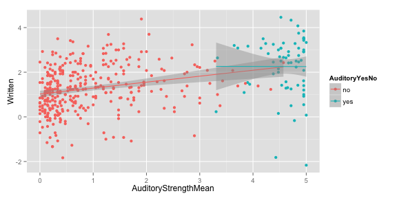
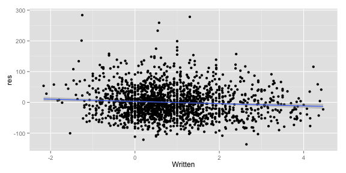
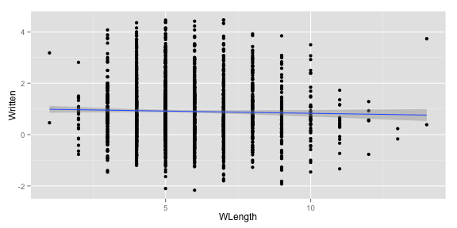
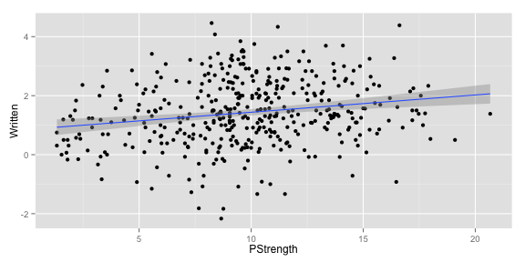

Iconicity analysis first exporation
========================================================

This document presents an exploratory analysis of the iconicity data using both lists:

* List 1: the original norms by Lynn, Marcus and Gary (N=592)
* List 2: the new norms (N=1360)

Several analyses were performed:

* part-of-speech differences for List 1 and List 2
* the relationship between AOA ***ratings*** and iconicity (a conceptual replication of your submitted paper?)
* the relationship between concreteness and iconicity
* the relationship between affect and iconicity
* the relationship between sensory modality ratings and iconicity
* finally: does iconicity predict unique RT variance?
* how is word length associated with iconicity? (Marcus's follow up question)
* how are the modality ratings related to concreteness? (Marcus question #2)


Load in data and packages. Relevel for better display:


```r
     icon <- read.csv("iconicity_ratings_both.csv")
     library(ggplot2)
     library(mgcv)
```

```
## Loading required package: nlme
## This is mgcv 1.8-6. For overview type 'help("mgcv-package")'.
```

```r
     icon$ContentPOS <- factor(icon$ContentPOS,
                              levels=c("Verb","Noun","Adjective","Adverb"))
```

<br><br><br>
## POS differences

How does iconicity differ depending on parts of speech differences?


```r
     ggplot(icon[!is.na(icon$ContentPOS),],
          aes(x=ContentPOS,y=Written,fill=ContentPOS)) +
          geom_boxplot() + facet_grid(~ListIdentifier)
```

 

```r
     anova(lm(Written ~ ContentPOS,subset(icon,ListIdentifier=="list1")))
```

```
## Analysis of Variance Table
## 
## Response: Written
##             Df Sum Sq Mean Sq F value    Pr(>F)    
## ContentPOS   3  33.58 11.1933  13.337 2.186e-08 ***
## Residuals  499 418.78  0.8392                      
## ---
## Signif. codes:  0 '***' 0.001 '**' 0.01 '*' 0.05 '.' 0.1 ' ' 1
```

```r
     anova(lm(Written ~ ContentPOS,subset(icon,ListIdentifier=="list2")))
```

```
## Analysis of Variance Table
## 
## Response: Written
##              Df  Sum Sq Mean Sq F value    Pr(>F)    
## ContentPOS    3  118.14  39.379   30.45 < 2.2e-16 ***
## Residuals  1310 1694.13   1.293                      
## ---
## Signif. codes:  0 '***' 0.001 '**' 0.01 '*' 0.05 '.' 0.1 ' ' 1
```

Notice that I have omitted "grammatical" for now. This is not straightforward, e.g., how should certain adverbs be treated?

<br><br><br>
## AOA ratings

How does iconicity depend on AOA ratings? (Taken from Kuperman et al.'s mega-norming study)


```r
     ggplot(icon,
            aes(x=AOA,y=Written)) +
          geom_point(shape=16) +
          geom_smooth(method="lm") + facet_grid(~ListIdentifier)
```

 

<br>
As expected given your search criteria, the original list has much higher AOA ratings. Overall, there is a significant downward trend with words rated to be acquired later having less iconicity, even after controlling for frequency:


```r
     summary(lm(Written ~ AOA+WordFreq,icon))
```

```
## 
## Call:
## lm(formula = Written ~ AOA + WordFreq, data = icon)
## 
## Residuals:
##     Min      1Q  Median      3Q     Max 
## -3.2497 -0.6746 -0.0951  0.5586  3.5080 
## 
## Coefficients:
##             Estimate Std. Error t value Pr(>|t|)    
## (Intercept)  2.92720    0.15273   19.17   <2e-16 ***
## AOA         -0.13093    0.01186  -11.04   <2e-16 ***
## WordFreq    -0.41224    0.03009  -13.70   <2e-16 ***
## ---
## Signif. codes:  0 '***' 0.001 '**' 0.01 '*' 0.05 '.' 0.1 ' ' 1
## 
## Residual standard error: 1.026 on 1790 degrees of freedom
##   (159 observations deleted due to missingness)
## Multiple R-squared:  0.09955,	Adjusted R-squared:  0.09854 
## F-statistic: 98.94 on 2 and 1790 DF,  p-value: < 2.2e-16
```

This shows the pure effect of AOA ratings with word frequency residualized out:


```r
     icon$res <- NA
     icon[!is.na(icon$WordFreq),]$res <- residuals(lm(Written ~ WordFreq,icon))
     ggplot(icon,
            aes(x=AOA,y=res)) +
          geom_point(shape=16) +
          geom_smooth(method="lm")
```

 

<br><br><br>
## Concreteness

How is iconicity related to concreteness?


```r
     ggplot(icon,
            aes(x=Conc,y=Written)) +
          geom_point(shape=16) +
          geom_smooth()
```

 

It seems to be that words of intermediate concreteness are the most iconic words. We can test this by fitting a quadratic model:


```r
     icon$Conc_c <- icon$Conc - mean(icon$Conc,na.rm=T)     # centering
     anova(lm(Written ~ Conc_c + I(Conc_c^2),icon))
```

```
## Analysis of Variance Table
## 
## Response: Written
##               Df  Sum Sq Mean Sq  F value    Pr(>F)    
## Conc_c         1    8.51   8.513   7.5245  0.006145 ** 
## I(Conc_c^2)    1  208.34 208.340 184.1586 < 2.2e-16 ***
## Residuals   1846 2088.39   1.131                       
## ---
## Signif. codes:  0 '***' 0.001 '**' 0.01 '*' 0.05 '.' 0.1 ' ' 1
```

<br><br><br>
## Affect ratings

How is iconicity related to affect? (FYI: I am taking a measure of "absolute valence" here. According to this measure highly valenced words have high numbers regardless of positive or negative valence)


```r
     ggplot(icon,
            aes(x=AbsValence,y=Written)) +
          geom_point(shape=16) +
          geom_smooth()
```

 

No clear trend detectable and no significant effect (fitting a GAM here)


```r
     summary(gam(Written ~ s(AbsValence),data=icon))
```

```
## 
## Family: gaussian 
## Link function: identity 
## 
## Formula:
## Written ~ s(AbsValence)
## 
## Parametric coefficients:
##             Estimate Std. Error t value Pr(>|t|)    
## (Intercept)  0.84712    0.02709   31.27   <2e-16 ***
## ---
## Signif. codes:  0 '***' 0.001 '**' 0.01 '*' 0.05 '.' 0.1 ' ' 1
## 
## Approximate significance of smooth terms:
##               edf Ref.df     F p-value
## s(AbsValence)   1      1 0.662   0.416
## 
## R-sq.(adj) =  -0.000215   Deviance explained = 0.0421%
## GCV = 1.1574  Scale est. = 1.1559    n = 1575
```

<br><br><br>
## Iconicity and modality

For the Lynott and Connell (2009) adjective norms, let's check the relationship between iconicity and the dominant modality, e.g., "shiny" has dominant modality = "visual".


```r
     ggplot(icon[!is.na(icon$DominantModality),],
            aes(x=DominantModality,y=Written,fill=DominantModality)) +
          geom_boxplot()
```

 

Let's do the same thing for the van Dantzig et al. (2013) norms, which are largely overlapping with Lynott and Connell (2009), but they stem from an independent rating:


```r
     ggplot(icon[!is.na(icon$DantzigDominantModality),],
            aes(x=DantzigDominantModality,y=Written,
                fill=DantzigDominantModality)) +
          geom_boxplot()
```

 

We can test whether there are significant iconicity differences between words for the different modalities:


```r
     anova(lm(Written ~ DominantModality,icon))
```

```
## Analysis of Variance Table
## 
## Response: Written
##                   Df Sum Sq Mean Sq F value    Pr(>F)    
## DominantModality   4  89.90 22.4741  21.079 7.928e-16 ***
## Residuals        412 439.28  1.0662                      
## ---
## Signif. codes:  0 '***' 0.001 '**' 0.01 '*' 0.05 '.' 0.1 ' ' 1
```

```r
     anova(lm(Written ~ DantzigDominantModality,icon))
```

```
## Analysis of Variance Table
## 
## Response: Written
##                          Df Sum Sq Mean Sq F value    Pr(>F)    
## DantzigDominantModality   4  92.90 23.2240  22.324 < 2.2e-16 ***
## Residuals               379 394.29  1.0403                      
## ---
## Signif. codes:  0 '***' 0.001 '**' 0.01 '*' 0.05 '.' 0.1 ' ' 1
```

Let's check which pairwise comparisons are significant using Tukey's HSD:


```r
     TukeyHSD(aov(Written ~ DominantModality,icon))
```

```
##   Tukey multiple comparisons of means
##     95% family-wise confidence level
## 
## Fit: aov(formula = Written ~ DominantModality, data = icon)
## 
## $DominantModality
##                           diff         lwr         upr     p adj
## Gustatory-Auditory  -1.4534923 -1.97756099 -0.92942353 0.0000000
## Haptic-Auditory     -0.4435719 -0.92528714  0.03814332 0.0875399
## Olfactory-Auditory  -1.2084949 -1.87021044 -0.54677940 0.0000082
## Visual-Auditory     -1.0428059 -1.43920853 -0.64640336 0.0000000
## Haptic-Gustatory     1.0099203  0.48907009  1.53077061 0.0000018
## Olfactory-Gustatory  0.2449973 -0.44572899  0.93572367 0.8677658
## Visual-Gustatory     0.4106863 -0.03245073  0.85382337 0.0840903
## Olfactory-Haptic    -0.7649230 -1.42409248 -0.10575353 0.0136760
## Visual-Haptic       -0.5992340 -0.99137172 -0.20709633 0.0003326
## Visual-Olfactory     0.1656890 -0.43396913  0.76534708 0.9425788
```

```r
     TukeyHSD(aov(Written ~ DantzigDominantModality,icon))
```

```
##   Tukey multiple comparisons of means
##     95% family-wise confidence level
## 
## Fit: aov(formula = Written ~ DantzigDominantModality, data = icon)
## 
## $DantzigDominantModality
##                            diff        lwr        upr     p adj
## Gustatory-Auditory  -1.26562606 -1.9579044 -0.5733477 0.0000082
## Haptic-Auditory     -0.66184131 -1.1468103 -0.1768724 0.0019694
## Olfactory-Auditory  -1.48903963 -2.0638231 -0.9142561 0.0000000
## Visual-Auditory     -1.18150618 -1.5653736 -0.7976388 0.0000000
## Haptic-Gustatory     0.60378475 -0.1035423  1.3111118 0.1347425
## Olfactory-Gustatory -0.22341357 -0.9950953  0.5482682 0.9324060
## Visual-Gustatory     0.08411988 -0.5581190  0.7263588 0.9964386
## Olfactory-Haptic    -0.82719832 -1.4200207 -0.2343760 0.0014337
## Visual-Haptic       -0.51966487 -0.9300505 -0.1092792 0.0052134
## Visual-Olfactory     0.30753345 -0.2058841  0.8209510 0.4716011
```

Finally, rather than looking at discrete comparisons between "dominant modality" and iconicity, we can look continuously at this, to see whether words that are ***not*** dominantly related to audition or touch relate to iconicity if they are relatively more "auditory" or "haptic":


```r
     icon$AuditoryYesNo <- ifelse(icon$DominantModality=="Auditory",
                                   "yes","no")
     ggplot(icon[!is.na(icon$DominantModality),],
          aes(x=AuditoryStrengthMean,y=Written,color=AuditoryYesNo)) +
          geom_point(shape=16) +
          geom_smooth(method="lm") 
```

 

Interesting, the auditory ones are already very high on iconicity and relative differences in "AuditoryStrength" do not create relative differences in iconicity for these words. However, the words that are not primarily auditory tend to be more iconic if they have higher "AuditoryStrength" measures. Although the effect looks tiny, so not sure whether they will be significant.

Let's do the same thing for the haptic modality:


```r
     icon$HapticYesNo <- ifelse(icon$DominantModality=="Haptic",
                                   "yes","no")
     ggplot(icon[!is.na(icon$DominantModality),],
          aes(x=HapticStrengthMean,y=Written,color=HapticYesNo)) +
          geom_point(shape=16) +
          geom_smooth(method="lm") 
```

 

This looks like a stronger effect, but only for the haptic words. Let's provide formal tests of both of these continuous models. Let's also test for the interaction, to see whether primarily "auditory" or "haptic" words behave differently. Since we have an interaction, we need to center effects ([Research Wahlberg](https://pbs.twimg.com/media/B7ag1xDCcAAiIyL.jpg:large)). To interpret the continuous effect, we should sum code the categorical predictors.


```r
     icon$HapticYesNo <- factor(icon$HapticYesNo,levels=c("yes","no"))
     icon$AuditoryYesNo <- factor(icon$AuditoryYesNo,levels=c("yes","no"))
     contrasts(icon$HapticYesNo) <- contr.sum(2)
     contrasts(icon$AuditoryYesNo) <- contr.sum(2)

     icon$HapticStrengthMean_c <- icon$HapticStrengthMean - mean(icon$HapticStrengthMean, na.rm=T)
     icon$AuditoryStrengthMean_c <- icon$AuditoryStrengthMean - mean(icon$AuditoryStrengthMean,na.rm=T)

     summary(lm(Written ~ HapticStrengthMean_c*HapticYesNo,icon))
```

```
## 
## Call:
## lm(formula = Written ~ HapticStrengthMean_c * HapticYesNo, data = icon)
## 
## Residuals:
##     Min      1Q  Median      3Q     Max 
## -3.5715 -0.7175 -0.0886  0.7490  3.0638 
## 
## Coefficients:
##                                   Estimate Std. Error t value Pr(>|t|)   
## (Intercept)                         0.8588     0.2892   2.969  0.00316 **
## HapticStrengthMean_c                0.3108     0.1313   2.368  0.01835 * 
## HapticYesNo1                       -0.4703     0.2892  -1.626  0.10467   
## HapticStrengthMean_c:HapticYesNo1   0.3482     0.1313   2.652  0.00830 **
## ---
## Signif. codes:  0 '***' 0.001 '**' 0.01 '*' 0.05 '.' 0.1 ' ' 1
## 
## Residual standard error: 1.109 on 413 degrees of freedom
##   (1535 observations deleted due to missingness)
## Multiple R-squared:  0.04079,	Adjusted R-squared:  0.03382 
## F-statistic: 5.854 on 3 and 413 DF,  p-value: 0.0006366
```

```r
     summary(lm(Written ~ AuditoryStrengthMean_c*AuditoryYesNo,icon))
```

```
## 
## Call:
## lm(formula = Written ~ AuditoryStrengthMean_c * AuditoryYesNo, 
##     data = icon)
## 
## Residuals:
##     Min      1Q  Median      3Q     Max 
## -4.4205 -0.6845  0.0213  0.7468  2.8543 
## 
## Coefficients:
##                                       Estimate Std. Error t value Pr(>|t|)
## (Intercept)                             1.8476     0.4962   3.723 0.000224
## AuditoryStrengthMean_c                  0.1304     0.1619   0.805 0.421095
## AuditoryYesNo1                          0.4256     0.4962   0.858 0.391570
## AuditoryStrengthMean_c:AuditoryYesNo1  -0.1359     0.1619  -0.840 0.401667
##                                          
## (Intercept)                           ***
## AuditoryStrengthMean_c                   
## AuditoryYesNo1                           
## AuditoryStrengthMean_c:AuditoryYesNo1    
## ---
## Signif. codes:  0 '***' 0.001 '**' 0.01 '*' 0.05 '.' 0.1 ' ' 1
## 
## Residual standard error: 1.047 on 413 degrees of freedom
##   (1535 observations deleted due to missingness)
## Multiple R-squared:  0.1438,	Adjusted R-squared:  0.1375 
## F-statistic: 23.11 on 3 and 413 DF,  p-value: 7.543e-14
```

So no ***continuous*** auditory effect on iconicity (at least not with the interaction), but one for the haptic modality.


<br><br><br>
## Does iconicity predict unique variance in reaction times?

For now, I am simply testing whether iconicity predicts unique variance in reaction times above and beyond AOA and word frequency. I am going to use the Lexical Decision times from the English Lexicon Project (Balota et al., 2007). 


```r
     summary(lm(RT ~ AOA + WordFreq + Written,icon))
```

```
## 
## Call:
## lm(formula = RT ~ AOA + WordFreq + Written, data = icon)
## 
## Residuals:
##     Min      1Q  Median      3Q     Max 
## -157.73  -40.07   -8.66   32.46  348.49 
## 
## Coefficients:
##             Estimate Std. Error t value Pr(>|t|)    
## (Intercept) 669.2723     9.9022  67.588   <2e-16 ***
## AOA           9.9071     0.7256  13.653   <2e-16 ***
## WordFreq    -31.0074     1.8758 -16.530   <2e-16 ***
## Written       1.0066     1.3894   0.724    0.469    
## ---
## Signif. codes:  0 '***' 0.001 '**' 0.01 '*' 0.05 '.' 0.1 ' ' 1
## 
## Residual standard error: 59.66 on 1756 degrees of freedom
##   (192 observations deleted due to missingness)
## Multiple R-squared:  0.4217,	Adjusted R-squared:  0.4207 
## F-statistic: 426.8 on 3 and 1756 DF,  p-value: < 2.2e-16
```

Once AOA and WordFreq is controlled for, there seems to be no effect of iconicity. However, what about the word naming reaction times?


```r
     summary(lm(NamingRT ~ AOA + WordFreq + Written,icon))
```

```
## 
## Call:
## lm(formula = NamingRT ~ AOA + WordFreq + Written, data = icon)
## 
## Residuals:
##     Min      1Q  Median      3Q     Max 
## -128.10  -34.18   -4.10   28.52  278.21 
## 
## Coefficients:
##             Estimate Std. Error t value Pr(>|t|)    
## (Intercept) 655.0656     8.2453  79.447  < 2e-16 ***
## AOA           5.5744     0.6042   9.226  < 2e-16 ***
## WordFreq    -20.6923     1.5619 -13.248  < 2e-16 ***
## Written      -4.0369     1.1569  -3.489 0.000496 ***
## ---
## Signif. codes:  0 '***' 0.001 '**' 0.01 '*' 0.05 '.' 0.1 ' ' 1
## 
## Residual standard error: 49.68 on 1756 degrees of freedom
##   (192 observations deleted due to missingness)
## Multiple R-squared:  0.2861,	Adjusted R-squared:  0.2849 
## F-statistic: 234.6 on 3 and 1756 DF,  p-value: < 2.2e-16
```

Let's visualize that effect by residualizing AOA and WordFreq out:


```r
     icon$res <- NA
     NAs <- (is.na(icon$WordFreq)|is.na(icon$AOA)|is.na(icon$NamingRT))
     icon[!NAs,]$res <- residuals(lm(NamingRT ~ WordFreq + AOA,
                                   icon[!NAs,]))
     ggplot(icon,
            aes(x=Written,y=res)) +
          geom_point(shape=16) +
          geom_smooth(method="lm") 
```

 
<br>
The effect is small, but hey... ~4ms less per increase of iconicity 1. Not too bad.

<br><br><br>
## How is word length related to iconicity?

Let's calculate word length, by now just using orthographic length as a proxy. Then we will plot that against iconicity.


```r
     icon$WLength <- nchar(as.character(icon$Word))
     ggplot(icon,
          aes(x=WLength,y=Written)) +
          geom_point(shape=16) +
          geom_smooth(method="lm")
```

 

No clear relation visible. Word length is obviously a factor that influences RTs, though, so let's see whether the above result regarding lexical decision tasks etc. is still robust with word length included.


```r
     summary(lm(RT ~ AOA + WordFreq + WLength + Written,icon))
```

```
## 
## Call:
## lm(formula = RT ~ AOA + WordFreq + WLength + Written, data = icon)
## 
## Residuals:
##     Min      1Q  Median      3Q     Max 
## -132.66  -39.58   -8.26   30.64  360.19 
## 
## Coefficients:
##             Estimate Std. Error t value Pr(>|t|)    
## (Intercept) 609.3212    10.8785  56.011   <2e-16 ***
## AOA           8.0993     0.7173  11.292   <2e-16 ***
## WordFreq    -25.9637     1.8616 -13.947   <2e-16 ***
## WLength      10.0982     0.8772  11.512   <2e-16 ***
## Written       3.4473     1.3568   2.541   0.0111 *  
## ---
## Signif. codes:  0 '***' 0.001 '**' 0.01 '*' 0.05 '.' 0.1 ' ' 1
## 
## Residual standard error: 57.54 on 1755 degrees of freedom
##   (192 observations deleted due to missingness)
## Multiple R-squared:  0.4623,	Adjusted R-squared:  0.4611 
## F-statistic: 377.2 on 4 and 1755 DF,  p-value: < 2.2e-16
```

```r
     summary(lm(NamingRT ~ AOA + WordFreq + WLength + Written,icon))
```

```
## 
## Call:
## lm(formula = NamingRT ~ AOA + WordFreq + WLength + Written, data = icon)
## 
## Residuals:
##      Min       1Q   Median       3Q      Max 
## -118.549  -33.026   -5.347   26.146  268.496 
## 
## Coefficients:
##             Estimate Std. Error t value Pr(>|t|)    
## (Intercept) 589.7215     8.8108  66.932  < 2e-16 ***
## AOA           3.6041     0.5809   6.204 6.86e-10 ***
## WordFreq    -15.1949     1.5077 -10.078  < 2e-16 ***
## WLength      11.0066     0.7105  15.492  < 2e-16 ***
## Written      -1.3767     1.0989  -1.253     0.21    
## ---
## Signif. codes:  0 '***' 0.001 '**' 0.01 '*' 0.05 '.' 0.1 ' ' 1
## 
## Residual standard error: 46.6 on 1755 degrees of freedom
##   (192 observations deleted due to missingness)
## Multiple R-squared:  0.372,	Adjusted R-squared:  0.3706 
## F-statistic: 259.9 on 4 and 1755 DF,  p-value: < 2.2e-16
```

With word length taken into account, the effect of iconicity on word naming times goes away!


<br><br><br>
## Looking at modality ratings and concreteness togther

Connell and Lynott (2012) showed that "perceptual strength" outperforms concreteness in predicting RTs. The measure used was simply the sum of all sensory strength associations, which we can easily compute and relate to iconicity. For comparability to the concreteness result above, let's also use a quadratic model.


```r
     icon$PStrength <- rowSums(icon[,grep("StrengthMean",names(icon))])
     ggplot(icon,
          aes(x=PStrength,y=Written)) +
          geom_point(shape=16) +
          geom_smooth(method="lm")
```

 

```r
     icon$PStrength_c <- icon$PStrength - mean(icon$PStrength,na.rm=T)#center
     pstrength.mdl <- lm(Written ~ PStrength_c + I(PStrength_c^2),icon)
     summary(pstrength.mdl)
```

```
## 
## Call:
## lm(formula = Written ~ PStrength_c + I(PStrength_c^2), data = icon)
## 
## Residuals:
##     Min      1Q  Median      3Q     Max 
## -3.6096 -0.6977 -0.0719  0.7562  3.0504 
## 
## Coefficients:
##                   Estimate Std. Error t value Pr(>|t|)    
## (Intercept)       1.512881   0.067076  22.555  < 2e-16 ***
## PStrength_c       0.057285   0.014577   3.930 9.96e-05 ***
## I(PStrength_c^2) -0.006482   0.002895  -2.239   0.0257 *  
## ---
## Signif. codes:  0 '***' 0.001 '**' 0.01 '*' 0.05 '.' 0.1 ' ' 1
## 
## Residual standard error: 1.103 on 414 degrees of freedom
##   (1535 observations deleted due to missingness)
## Multiple R-squared:  0.04871,	Adjusted R-squared:  0.04411 
## F-statistic:  10.6 on 2 and 414 DF,  p-value: 3.245e-05
```

It looks like there is a negative quadratic effect, like for concreteness. Let's compare the concreteness model and the PStrength model using AICs.


```r
     conc.mdl <- lm(Written ~ Conc + I(Conc^2),icon)
     AIC(conc.mdl)
```

```
## [1] 5480.348
```

```r
     AIC(pstrength.mdl)
```

```
## [1] 1269.914
```

The perceptual strength measure outperforms concreteness by great lengths (usually an AIC difference of 10 would already be considered "significant"; Richards et al., 2011, "Model selection and model averaging in behavioural ecology: the utility of the IT-AIC framework").

If we put both of them into the same model, perceptual strength outperforms concreteness:


```r
     xmdl <- lm(Written ~ Conc_c + I(Conc_c^2) +
                    PStrength_c + I(PStrength_c^2),icon)
```

This is **not** simply due to them being collinear. In fact, there seems to be no issue with collinearity, as variance inflation factors show (values "substantially in excess of 1" are usually interpreted as bad, >3 is reason to worry):

```r
     library(car)
     vif(xmdl)
```

```
##           Conc_c      I(Conc_c^2)      PStrength_c I(PStrength_c^2) 
##         1.348466         1.328618         1.004943         1.094345
```

So there's no problem with collinearity per se.


<br><br><br><br><br>

