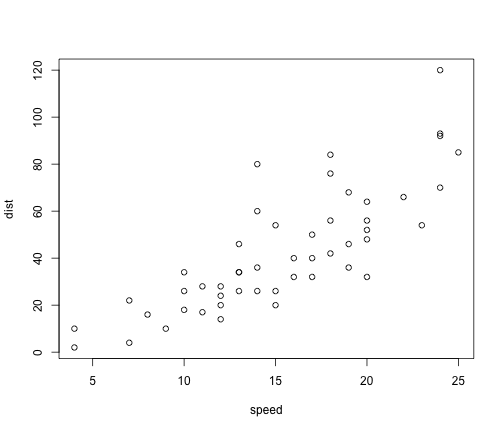

Iconicity analysis first exporation
========================================================

This document presents an exploratory analysis of the iconicity data using both lists:

* the original norms by Lynn, Marcus and Gary (N=592)
* the new norms (N=1360)

Several analyses will be presented, first:

* replicating the POS differences for List 1 and List 2
* the relationship between AOA ***ratings*** and iconicity
* the relationship between concreteness and iconicity
* the relationship between modalities and iconicity


When you click the **Knit HTML** button a web page will be generated that includes both content as well as the output of any embedded R code chunks within the document. You can embed an R code chunk like this:


```r
summary(cars)
```

```
##      speed           dist       
##  Min.   : 4.0   Min.   :  2.00  
##  1st Qu.:12.0   1st Qu.: 26.00  
##  Median :15.0   Median : 36.00  
##  Mean   :15.4   Mean   : 42.98  
##  3rd Qu.:19.0   3rd Qu.: 56.00  
##  Max.   :25.0   Max.   :120.00
```

You can also embed plots, for example:


```r
plot(cars)
```

 

