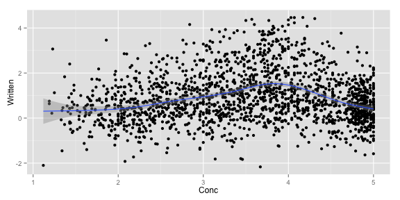

Iconicity analysis first exporation
========================================================

This document presents an exploratory analysis of the iconicity data using both lists:

* List 1: the original norms by Lynn, Marcus and Gary (N=592)
* List 2: the new norms (N=1360)

Several analyses were performed:

* part-of-speech differences for List 1 and List 2
* the relationship between AOA ***ratings*** and iconicity (a conceptual replication of your submitted paper?)
* the relationship between concreteness and iconicity
* the relationship between affect and iconicity
* the relationship between sensory modality ratings and iconicity
* finally: does iconicity predict unique RT variance?


Load in data and packages. Relevel for better display:


```r
     icon <- read.csv("iconicity_ratings_both.csv")
     library(ggplot2)
     library(mgcv)
```

```
## Loading required package: nlme
## This is mgcv 1.8-6. For overview type 'help("mgcv-package")'.
```

```r
     icon$ContentPOS <- factor(icon$ContentPOS,
                              levels=c("Verb","Noun","Adjective","Adverb"))
```

<br><br><br>
## POS differences

How does iconicity differ depending on parts of speech differences?


```r
     ggplot(icon[!is.na(icon$ContentPOS),],
          aes(x=ContentPOS,y=Written,fill=ContentPOS)) +
          geom_boxplot() + facet_grid(~ListIdentifier)
```

 

```r
     anova(lm(Written ~ ContentPOS,subset(icon,ListIdentifier=="list1")))
```

```
## Analysis of Variance Table
## 
## Response: Written
##             Df Sum Sq Mean Sq F value    Pr(>F)    
## ContentPOS   3  33.58 11.1933  13.337 2.186e-08 ***
## Residuals  499 418.78  0.8392                      
## ---
## Signif. codes:  0 '***' 0.001 '**' 0.01 '*' 0.05 '.' 0.1 ' ' 1
```

```r
     anova(lm(Written ~ ContentPOS,subset(icon,ListIdentifier=="list2")))
```

```
## Analysis of Variance Table
## 
## Response: Written
##              Df  Sum Sq Mean Sq F value    Pr(>F)    
## ContentPOS    3  118.14  39.379   30.45 < 2.2e-16 ***
## Residuals  1310 1694.13   1.293                      
## ---
## Signif. codes:  0 '***' 0.001 '**' 0.01 '*' 0.05 '.' 0.1 ' ' 1
```

Notice that I have omitted "grammatical" for now. This is not straightforward, e.g., how should certain adverbs be treated?

<br><br><br>
## AOA ratings

How does iconicity depend on AOA ratings? (Taken from Kuperman et al.'s mega-norming study)


```r
     ggplot(icon,
            aes(x=AOA,y=Written)) +
          geom_point(shape=16) +
          geom_smooth(method="lm") + facet_grid(~ListIdentifier)
```

 

<br>
As expected given your search criteria, the original list has much higher AOA ratings. Overall, there is a significant downward trend with words rated to be acquired later having less iconicity, even after controlling for frequency:


```r
     summary(lm(Written ~ AOA+WordFreq,icon))
```

```
## 
## Call:
## lm(formula = Written ~ AOA + WordFreq, data = icon)
## 
## Residuals:
##     Min      1Q  Median      3Q     Max 
## -3.2497 -0.6746 -0.0951  0.5586  3.5080 
## 
## Coefficients:
##             Estimate Std. Error t value Pr(>|t|)    
## (Intercept)  2.92720    0.15273   19.17   <2e-16 ***
## AOA         -0.13093    0.01186  -11.04   <2e-16 ***
## WordFreq    -0.41224    0.03009  -13.70   <2e-16 ***
## ---
## Signif. codes:  0 '***' 0.001 '**' 0.01 '*' 0.05 '.' 0.1 ' ' 1
## 
## Residual standard error: 1.026 on 1790 degrees of freedom
##   (159 observations deleted due to missingness)
## Multiple R-squared:  0.09955,	Adjusted R-squared:  0.09854 
## F-statistic: 98.94 on 2 and 1790 DF,  p-value: < 2.2e-16
```

This shows the pure effect of AOA ratings with word frequency residualized out:


```r
     icon$res <- NA
     icon[!is.na(icon$WordFreq),]$res <- residuals(lm(Written ~ WordFreq,icon))
     ggplot(icon,
            aes(x=AOA,y=res)) +
          geom_point(shape=16) +
          geom_smooth(method="lm")
```

 

<br><br><br>
## Concreteness

How is iconicity related to concreteness?


```r
     ggplot(icon,
            aes(x=Conc,y=Written)) +
          geom_point(shape=16) +
          geom_smooth()
```

 

It seems to be that words of intermediate concreteness are the most iconic words. We can test this by fitting a quadratic model:


```r
     anova(lm(Written ~ Conc + I(Conc^2),icon))
```

```
## Analysis of Variance Table
## 
## Response: Written
##             Df  Sum Sq Mean Sq  F value    Pr(>F)    
## Conc         1    8.51   8.513   7.5245  0.006145 ** 
## I(Conc^2)    1  208.34 208.340 184.1586 < 2.2e-16 ***
## Residuals 1846 2088.39   1.131                       
## ---
## Signif. codes:  0 '***' 0.001 '**' 0.01 '*' 0.05 '.' 0.1 ' ' 1
```

<br><br><br>
## Affect ratings

How is iconicity related to affect? (FYI: I am taking a measure of "absolute valence" here. According to this measure highly valenced words have high numbers regardless of positive or negative valence)


```r
     ggplot(icon,
            aes(x=AbsValence,y=Written)) +
          geom_point(shape=16) +
          geom_smooth()
```

 

No clear trend detectable and no significant effect (fitting a GAM here)


```r
     summary(gam(Written ~ s(AbsValence),data=icon))
```

```
## 
## Family: gaussian 
## Link function: identity 
## 
## Formula:
## Written ~ s(AbsValence)
## 
## Parametric coefficients:
##             Estimate Std. Error t value Pr(>|t|)    
## (Intercept)  0.84712    0.02709   31.27   <2e-16 ***
## ---
## Signif. codes:  0 '***' 0.001 '**' 0.01 '*' 0.05 '.' 0.1 ' ' 1
## 
## Approximate significance of smooth terms:
##               edf Ref.df     F p-value
## s(AbsValence)   1      1 0.662   0.416
## 
## R-sq.(adj) =  -0.000215   Deviance explained = 0.0421%
## GCV = 1.1574  Scale est. = 1.1559    n = 1575
```

<br><br><br>
## Iconicity and modality

For the Lynott and Connell (2009) adjective norms, let's check the relationship between iconicity and the dominant modality, e.g., "shiny" has dominant modality = "visual".


```r
     ggplot(icon[!is.na(icon$DominantModality),],
            aes(x=DominantModality,y=Written,fill=DominantModality)) +
          geom_boxplot()
```

 

Let's do the same thing for the van Dantzig et al. (2013) norms, which are largely overlapping with Lynott and Connell (2009), but they stem from an independent rating:


```r
     ggplot(icon[!is.na(icon$DantzigDominantModality),],
            aes(x=DantzigDominantModality,y=Written,
                fill=DantzigDominantModality)) +
          geom_boxplot()
```

 

We can test whether there are significant iconicity differences between words for the different modalities:


```r
     anova(lm(Written ~ DominantModality,icon))
```

```
## Analysis of Variance Table
## 
## Response: Written
##                   Df Sum Sq Mean Sq F value    Pr(>F)    
## DominantModality   4  89.90 22.4741  21.079 7.928e-16 ***
## Residuals        412 439.28  1.0662                      
## ---
## Signif. codes:  0 '***' 0.001 '**' 0.01 '*' 0.05 '.' 0.1 ' ' 1
```

```r
     anova(lm(Written ~ DantzigDominantModality,icon))
```

```
## Analysis of Variance Table
## 
## Response: Written
##                          Df Sum Sq Mean Sq F value    Pr(>F)    
## DantzigDominantModality   4  92.90 23.2240  22.324 < 2.2e-16 ***
## Residuals               379 394.29  1.0403                      
## ---
## Signif. codes:  0 '***' 0.001 '**' 0.01 '*' 0.05 '.' 0.1 ' ' 1
```


<br><br><br>
## Does iconicity predict unique variance in reaction times?

For now, I am simply testing whether iconicity predicts unique variance in reaction times above and beyond AOA and word frequency. I am going to use the Lexical Decision times from the English Lexicon Project (Balota et al., 2007). 


```r
     summary(lm(RT ~ AOA + WordFreq + Written,icon))
```

```
## 
## Call:
## lm(formula = RT ~ AOA + WordFreq + Written, data = icon)
## 
## Residuals:
##     Min      1Q  Median      3Q     Max 
## -157.73  -40.07   -8.66   32.46  348.49 
## 
## Coefficients:
##             Estimate Std. Error t value Pr(>|t|)    
## (Intercept) 669.2723     9.9022  67.588   <2e-16 ***
## AOA           9.9071     0.7256  13.653   <2e-16 ***
## WordFreq    -31.0074     1.8758 -16.530   <2e-16 ***
## Written       1.0066     1.3894   0.724    0.469    
## ---
## Signif. codes:  0 '***' 0.001 '**' 0.01 '*' 0.05 '.' 0.1 ' ' 1
## 
## Residual standard error: 59.66 on 1756 degrees of freedom
##   (192 observations deleted due to missingness)
## Multiple R-squared:  0.4217,	Adjusted R-squared:  0.4207 
## F-statistic: 426.8 on 3 and 1756 DF,  p-value: < 2.2e-16
```

Once AOA and WordFreq is controlled for, there seems to be no effect of iconicity. However, what about the word naming reaction times?


```r
     summary(lm(NamingRT ~ AOA + WordFreq + Written,icon))
```

```
## 
## Call:
## lm(formula = NamingRT ~ AOA + WordFreq + Written, data = icon)
## 
## Residuals:
##     Min      1Q  Median      3Q     Max 
## -128.10  -34.18   -4.10   28.52  278.21 
## 
## Coefficients:
##             Estimate Std. Error t value Pr(>|t|)    
## (Intercept) 655.0656     8.2453  79.447  < 2e-16 ***
## AOA           5.5744     0.6042   9.226  < 2e-16 ***
## WordFreq    -20.6923     1.5619 -13.248  < 2e-16 ***
## Written      -4.0369     1.1569  -3.489 0.000496 ***
## ---
## Signif. codes:  0 '***' 0.001 '**' 0.01 '*' 0.05 '.' 0.1 ' ' 1
## 
## Residual standard error: 49.68 on 1756 degrees of freedom
##   (192 observations deleted due to missingness)
## Multiple R-squared:  0.2861,	Adjusted R-squared:  0.2849 
## F-statistic: 234.6 on 3 and 1756 DF,  p-value: < 2.2e-16
```

Let's visualize that effect by residualizing AOA and WordFreq out:


```r
     icon$res <- NA
     NAs <- (is.na(icon$WordFreq)|is.na(icon$AOA)|is.na(icon$NamingRT))
     icon[!NAs,]$res <- residuals(lm(NamingRT ~ WordFreq + AOA,
                                   icon[!NAs,]))
     ggplot(icon,
            aes(x=Written,y=res)) +
          geom_point(shape=16) +
          geom_smooth(method="lm") 
```

 
<br>
The effect is small, but hey... ~4ms less per increase of iconicity 1. Not too bad.


